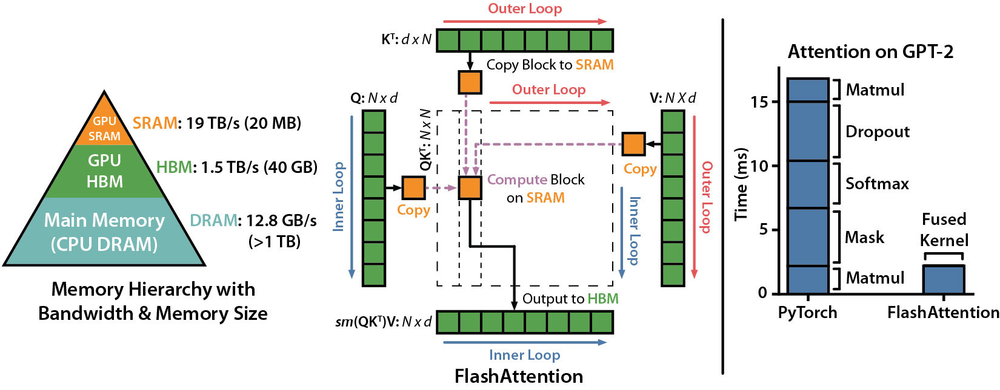

# graduation-project

🤗CQU计算机学院毕业设计——基于MindSpore的Falcon大模型迁移与性能研究。

项目部分为华为昇思MindSpore社区开源任务，基于MindSpore的一个NLP易用开源库MindNLP https://github.com/mindlab-ai/mindnlp。

## 模型迁移与精度对齐

src目录为falcon的MindSpore实现，实验证明该版本实现与HuggingFace中模型实现在容纳误差为$`10^{-3}`$的前提下两者等效，完整模型已上传至modelscope社区，截至目前下载量已达**3.1k** 。https://www.modelscope.cn/models/mindnlp/falcon-rw-1b/summary ，包括模型实现、所需配置文件以及转换好的预训练权重文件，也可在[hypertseng/falcon-rw-1b_mindspore (github.com)](https://github.com/hypertseng/falcon-rw-1b_mindspore)里获取除checkpoint之外的代码与配置文件。
单元测试包含模型配置与文本生成的67项测试，已全部通过，具体测试项目与代码见test目录。搭建好项目环境后，进入mindnlp目录在终端输入以下命令可进行测试：

```
export RUN_SLOW=True  // 若需要进行文本生成测试（耗费时间很长）
pytest -vs tests/ut/transformers/models/falcon
```

## 单卡lora微调

train_falcon为在MindNLP框架中基于falcon-rw-1b预训练模型进行微调的代码，数据集为GLUE基准数据集中的MRPC语料，任务是语义匹配。

默认训练10epoch，因为模型本身理解能力较强，实验表明在训练5个epoch之后已基本收敛，训练好的文件已放在peft_model目录下，可直接加载。

### 数据集下载

通过mrpc_dataset.py脚本中load_examples接口自动从Hugging Face下载并加载数据集。

### 模型下载

可通过Huggingface镜像站快速加载模型。

```bash
wget https://hf-mirror.com/hfd/hfd.sh
chmod a+x hfd.sh
./hfd.sh Rocketknight1/falcon-rw-1b --tool aria2c -x 4  # 这里选择下载规模最小的版本，若有足够的硬件支持，可下载其他版本
```

### 训练命令

训练之前先确保已经下载好模型文件，文件默认存放目录为.mindnlp/model/Rocketknight1/falcon-rw-1b。

在mindnlp根目录下执行如下命令。

```
python llm/peft/train_falcon/train_mrpc.py \
--save_dir ".mindnlp/peft_model/falcon/mrpc_lora" \
--batch_size 8 \
--model_name_or_path ".mindnlp/model/Rocketknight1/falcon-rw-1b" \
--max_seq_len 256 \
--lora
```

## FlashAttention支持

原预计通过AOT Compiler基于高级领域特定语言(Domain-Specific Languages, DSL)Triton编写的较完备的FlashAttention实现编译得到Low Level的CUDA kernel，再通过Custom自定义算子的方式加载进MindSpore，但经研究发现，Triton AOT Compiler的编译逻辑在预定模板代码的基础上直接嵌入了通过PTX生成的cubin二进制文件，cubin文件只能在CUDA Runtime中加载运行，并不是生成kernel代码。因此，参考了代码https://github.com/tspeterkim/flash-attention-minimal/blob/main/flash.cu ，用纯CUDA C++编写了FlashAttention kernel，目前实现了FlashAttention_v1与FlashAttention_v2的正反向计算（含causal mask），但只支持静态block size与FP32数据格式，可实现**3.5x-94x**的加速。仓库中包含了调试FlashAttention_v1与FlashAttention_v2的的vscode调试设置与CUDA C++代码，可供初学者使用。

可在mindnlp根目录下通过以下脚本测试其正确性并通过mindsight查看性能分析结果：

```bash
# 开启mindinsight 记录算子运行耗时
mindinsight start

pytest -vs ./tests/ut/modules/test_flashattention.py
```

FlashAttention论文出处如下：



**FlashAttention: Fast and Memory-Efficient Exact Attention with IO-Awareness**
Tri Dao, Daniel Y. Fu, Stefano Ermon, Atri Rudra, Christopher Ré
Paper: https://arxiv.org/abs/2205.14135

**FlashAttention-2: Faster Attention with Better Parallelism and Work Partitioning**
Tri Dao

Paper: https://tridao.me/publications/flash2/flash2.pdf

## Create your ChatBot in 5 min

### 环境搭建

```bash
pip install git+https://github.com/mindspore-lab/mindnlp.git
# or
git clone https://github.com/mindspore-lab/mindnlp.git
cd mindnlp
bash scripts/build_and_reinstall.sh#安装Mindnlp
pip install git+https://github.com/mindspore-lab/mindnlp.git
```

### requirements

```bash
pip install "mindspore>=2.2"
```

### quickly start

```python
repo = "Rocketknight1/falcon-rw-1b"
tokenizer = AutoTokenizer.from_pretrained(repo)
model = AutoModelForCausalLM.from_pretrained(repo)
model.set_train(False)
pipeline = mindnlp.transformers.pipeline(
    "text-generation",
    model=model,
    tokenizer=tokenizer,
    torch_dtype=ms.bfloat16,
    trust_remote_code=True,
)

sequences = pipeline(
   "Girafatron is obsessed with giraffes, the most glorious animal on the face of this Earth. Giraftron believes all other animals are irrelevant when compared to the glorious majesty of the giraffe.\nDaniel: Hello, Girafatron!\nGirafatron:",
    max_length=200,
    do_sample=True,
    top_k=10,
    num_return_sequences=1,
    eos_token_id=tokenizer.eos_token_id,
)
for seq in sequences:
    print(f"Result: {seq['generated_text']}")

```
